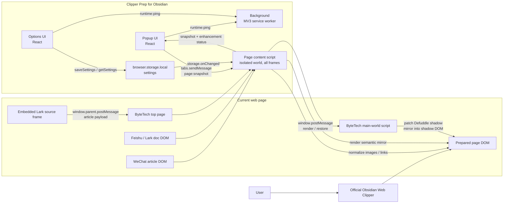

# Clipper Prep for Obsidian

[中文](README.md) · [English](README.en.md) · [日本語](README.ja.md)

Clipper Prep for Obsidian is a Chromium MV3 extension that prepares complex web pages before they are captured with the official [Obsidian Web Clipper](https://obsidian.md/clipper), helping the final Markdown in Obsidian become cleaner and more complete.

This project is independent from the official Obsidian Web Clipper. It does not replace the official clipper; it improves the page DOM so the official clipper can read content that is easier to convert into Markdown.

## What It Is

Many websites do not expose article content, images, and links as straightforward HTML. They may rely on lazy loading, virtual scrolling, shadow DOM, embedded frames, or custom rendered nodes. Clipper Prep for Obsidian prepares those structures before clipping:

- Normalizes article image URLs and attributes.
- Mirrors rendered document blocks into semantic article HTML.
- Preserves Lark / Feishu rendered links so they can become `[text](url)`.
- Shows the current page enhancement status in the Popup.
- Lets users toggle site enhancers and global processors from Options.

## Supported Capabilities

| Scope | What it does |
| --- | --- |
| WeChat Official Accounts | Normalizes image `src`, `data-src`, `loading`, `alt`, and related attributes in `mp.weixin.qq.com/s...` articles. |
| ByteTech Articles | Reads the embedded Lark document frame in `bytetech.info/articles...` and mirrors semantic article HTML into the top page. |
| Feishu / Lark Documents | Converts rendered document blocks on `feishu.cn/docx...`, `larkoffice.com/docx...`, and `larksuite.com/docx...` into an article mirror. |
| Global Markdown Links | Enabled by default; normalizes `data-href` links so clipped Markdown can keep `[text](url)`. |

## Communication Architecture

The main idea is simple: this extension prepares the live page DOM first, then users clip the prepared page with the official Obsidian Web Clipper as usual.

## Usage

1. Install dependencies: `npm install`
2. Start development mode: `npm run dev`
3. Build for production: `npm run build`
4. Load `dist/chrome-mv3` as an unpacked extension in Chromium / Chrome.
5. Open Options and enable the site enhancers you need.
6. Open the target page and confirm the Popup shows the enhancer as active.
7. Clip with the official Obsidian Web Clipper.

## Scripts

- `npm run dev`: Start WXT in Chrome development mode.
- `npm run build`: Build `dist/chrome-mv3`.
- `npm run zip`: Package the Chrome extension.
- `npm run typecheck`: Run TypeScript checks.
- `npm run test`: Run Vitest.
- `npm run lint`: Run ESLint.

## Bundled Codex Skill

This repository includes a Codex skill for generating extension store materials: [plugin-store-assets](skills/plugin-store-assets/SKILL.md).

To install it locally, copy `skills/plugin-store-assets` to `~/.codex/skills/plugin-store-assets`.

## Store Assets

- [Summary and description](store-assets/summary-description.md)
- [Icon 128x128](store-assets/icon-128.png)
- [Screenshot 1280x800](store-assets/screenshot-1280x800.png)
- [Small promo tile 440x280](store-assets/promo-small-440x280.png)
- [Marquee promo tile 1400x560](store-assets/promo-marquee-1400x560.png)
