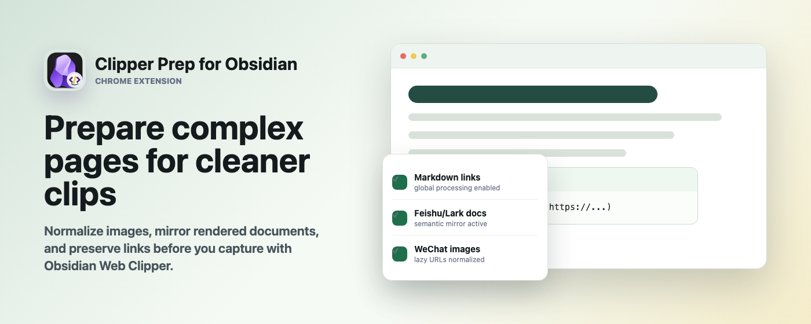
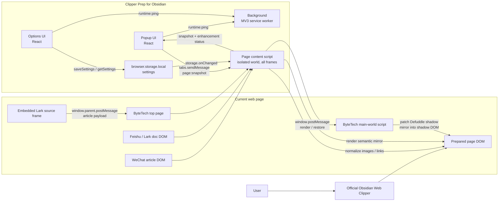

# Clipper Prep for Obsidian

[中文](README.zh-CN.md) · [English](README.md) · [日本語](README.ja.md)

Clipper Prep for Obsidian は、公式 [Obsidian Web Clipper](https://obsidian.md/clipper) で保存する前に複雑な Web ページを整える Chromium MV3 拡張機能です。Obsidian に入る最終的な Markdown を、より完全で読みやすいものにします。

このプロジェクトは公式 Obsidian Web Clipper とは独立しています。公式クリッパーを置き換えるものではなく、公式クリッパーが Markdown に変換しやすい内容を読み取れるようにページ DOM を改善します。

## 概要

多くの Web サイトでは、記事本文、画像、リンクが単純な HTML として公開されていません。遅延読み込み、仮想スクロール、shadow DOM、埋め込み frame、独自のレンダリングノードなどが使われることがあります。Clipper Prep for Obsidian は、クリップ前にそれらの構造を整えます。

- 記事画像の URL と属性を正規化します。
- レンダリング済みドキュメントブロックをセマンティックな記事 HTML にミラーします。
- Lark / Feishu のレンダリングリンクを保持し、`[text](url)` に変換しやすくします。
- Popup で現在ページの拡張状態を表示します。
- Options からサイト別拡張とグローバル処理を切り替えできます。

## 対応機能

| 対象 | 処理内容 |
| --- | --- |
| WeChat Official Accounts | `mp.weixin.qq.com/s...` の記事画像に対して、`src`、`data-src`、`loading`、`alt` などを正規化します。 |
| ByteTech Articles | `bytetech.info/articles...` に埋め込まれた Lark ドキュメント frame を読み取り、トップページにセマンティックな記事 HTML をミラーします。 |
| Feishu / Lark Documents | `feishu.cn/docx...`、`larkoffice.com/docx...`、`larksuite.com/docx...` のレンダリング済みドキュメントブロックを記事ミラーに変換します。 |
| Global Markdown Links | デフォルトで有効です。`data-href` リンクを正規化し、クリップ結果に `[text](url)` を残しやすくします。 |

## 通信アーキテクチャ

基本的な考え方はシンプルです。この拡張機能がまず現在のページ DOM を整え、その後ユーザーは公式 Obsidian Web Clipper で通常どおりクリップします。

## 使い方

1. 依存関係をインストールします: `npm install`
2. 開発モードを起動します: `npm run dev`
3. 本番ビルドを作成します: `npm run build`
4. Chromium / Chrome で `dist/chrome-mv3` を未パッケージ拡張機能として読み込みます。
5. Options を開き、必要なサイト拡張を有効にします。
6. 対象ページを開き、Popup で enhancer が active になっていることを確認します。
7. 公式 Obsidian Web Clipper で通常どおりクリップします。

## スクリプト

- `npm run dev`: WXT の Chrome 開発モードを起動します。
- `npm run build`: `dist/chrome-mv3` をビルドします。
- `npm run zip`: Chrome 拡張機能をパッケージ化します。
- `npm run typecheck`: TypeScript の型チェックを実行します。
- `npm run test`: Vitest を実行します。
- `npm run lint`: ESLint を実行します。

## 同梱 Codex Skill

このリポジトリには、拡張機能ストア素材を生成するための Codex skill が含まれています: [plugin-store-assets](skills/plugin-store-assets/SKILL.md)。

ローカルにインストールするには、`skills/plugin-store-assets` を `~/.codex/skills/plugin-store-assets` にコピーします。

## ストア用素材

- [概要と説明](store-assets/summary-description.md)
- [アイコン 128x128](store-assets/icon-128.png)
- [スクリーンショット 1280x800](store-assets/screenshot-1280x800.png)
- [小型プロモーション画像 440x280](store-assets/promo-small-440x280.png)
- [トッププロモーション画像 1400x560](store-assets/promo-marquee-1400x560.png)
