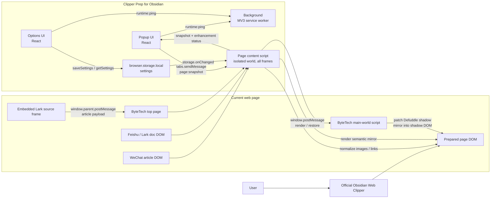

# Clipper Prep for Obsidian

[中文](README.md) · [English](README.en.md) · [日本語](README.ja.md)

Clipper Prep for Obsidian 是一个 Chromium MV3 浏览器插件，用于在官方 [Obsidian Web Clipper](https://obsidian.md/clipper) 剪藏前预处理复杂网页，让最终进入 Obsidian 的 Markdown 更完整、更干净。

本项目独立于官方 Obsidian Web Clipper。它不替代官方剪藏器，而是改善页面 DOM，让官方剪藏器可以读取更适合转换为 Markdown 的内容。

## 这是什么

很多网页的正文、图片和链接并不是直接以普通 HTML 呈现，而是通过懒加载、虚拟滚动、shadow DOM、内嵌 frame 或自定义渲染节点生成。Clipper Prep for Obsidian 会在剪藏前处理这些页面结构：

- 规范文章图片地址和属性。
- 将渲染型文档块镜像为语义化文章 HTML。
- 保留 Lark / Feishu 渲染链接，让它们能成为 `[text](url)`。
- 在 Popup 中显示当前页面增强状态。
- 在 Options 中开关站点增强和全局处理。

## 支持能力

| 范围 | 处理内容 |
| --- | --- |
| WeChat Official Accounts | 规范 `mp.weixin.qq.com/s...` 文章图片的 `src`、`data-src`、`loading`、`alt` 等属性。 |
| ByteTech Articles | 读取 `bytetech.info/articles...` 中嵌入的 Lark 文档 frame，并在顶层页面镜像语义化文章。 |
| Feishu / Lark Documents | 将 `feishu.cn/docx...`、`larkoffice.com/docx...`、`larksuite.com/docx...` 的渲染文档块转换为文章镜像。 |
| Global Markdown Links | 默认开启，规范 Lark / Feishu 等页面里的 `data-href` 链接，让剪藏结果保留 `[text](url)`。 |

## 通信架构

核心思路很简单：插件先准备当前页面 DOM，用户再像平时一样使用官方 Obsidian Web Clipper 读取这个准备好的页面。

## 使用方式

1. 安装依赖：`npm install`
2. 开发模式：`npm run dev`
3. 生产构建：`npm run build`
4. 在 Chromium / Chrome 中加载 `dist/chrome-mv3` 为未打包扩展。
5. 打开 Options，启用需要的站点增强。
6. 打开目标页面，确认 Popup 中增强状态为 active。
7. 使用官方 Obsidian Web Clipper 正常剪藏。

## 开发脚本

- `npm run dev`: 启动 WXT Chrome 开发模式。
- `npm run build`: 构建 `dist/chrome-mv3`。
- `npm run zip`: 打包 Chrome 扩展。
- `npm run typecheck`: 运行 TypeScript 类型检查。
- `npm run test`: 运行 Vitest。
- `npm run lint`: 运行 ESLint。

## 内置 Codex Skill

仓库内包含一个用于生成插件商店物料的 Codex skill：[plugin-store-assets](skills/plugin-store-assets/SKILL.md)。

如果要安装到本机 Codex，可复制 `skills/plugin-store-assets` 到 `~/.codex/skills/plugin-store-assets`。

## 商店物料

- [摘要与说明](store-assets/summary-description.md)
- [图标 128x128](store-assets/icon-128.png)
- [屏幕截图 1280x800](store-assets/screenshot-1280x800.png)
- [小型宣传图块 440x280](store-assets/promo-small-440x280.png)
- [顶部宣传图块 1400x560](store-assets/promo-marquee-1400x560.png)
