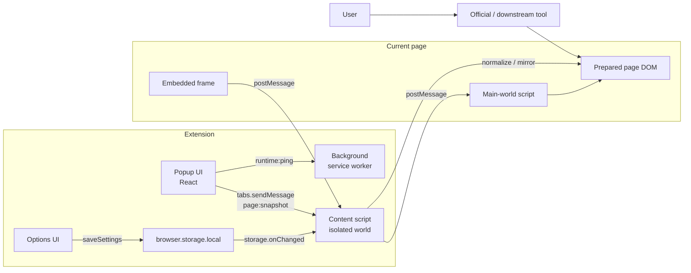

# Plugin Store Asset Spec

## Standard Deliverables

| Asset | Size | Notes |
| --- | --- | --- |
| Icon | `128x128` | Must be readable at small sizes. Keep one canonical source, usually SVG. |
| Screenshot | `1280x800` or `640x400` | Show the real product value: UI state, before/after, or core workflow. |
| Small promo tile | `440x280` | Short headline, logo, one visual proof point. Avoid tiny dense copy. |
| Marquee/top promo tile | `1400x560` | Strong product name and value proposition, consistent logo, enough safe margins. |
| Summary | Usually English, concise | One sentence. For Chrome Web Store, keep it short and outcome-oriented. |
| Description | User-facing | Cover purpose, why install, supported capabilities, usage, and independence from upstream projects when relevant. |

## Visual Rules

- Use a single canonical logo source across all generated images.
- If the product belongs to an ecosystem such as Obsidian, preserve ecosystem recognition while adding a product-specific marker such as a clipper, link, Markdown, plus, or document badge.
- Do not use a third-party logo unchanged when the user asks for a modified/derived plugin logo.
- Prefer source assets (`.svg`, `.html`) plus exported `.png` files so later edits are cheap.
- Avoid decorative assets that do not reveal the plugin’s actual purpose.
- Keep text inside graphic containers; inspect generated images after rendering.

## Copy Pattern

Summary:

```text
Prepare pages for cleaner Obsidian Web Clipper captures across supported sites and rendered links.
```

Description structure:

1. One sentence describing the extension’s job.
2. Clarify whether it replaces or complements the upstream tool.
3. Bullet supported capabilities.
4. Bullet reasons to install.
5. Short usage workflow.

## README Pattern

- Put the main promo image first:

```markdown
[](store-assets/promo-marquee-1400x560.png)
```

- Add language links when multiple files exist:

```markdown
[中文](README.md) · [English](README.en.md) · [日本語](README.ja.md)
```

- Prefer separate language files over one very long multilingual README when the user asks for trilingual output.
- Include links to generated store assets.

## Architecture Diagram Pattern

Use Mermaid when the project has extension messaging. Include:

- User and official/downstream tool.
- Popup UI, Options UI, background/service worker.
- Content script and page DOM.
- Storage changes.
- `tabs.sendMessage`, `runtime:ping`, `storage.onChanged`.
- `window.postMessage` or frame messages when content crosses isolated/main worlds or iframes.

Starter:



Prefer plain quoted node labels and `<br/>` for line breaks for GitHub compatibility.
